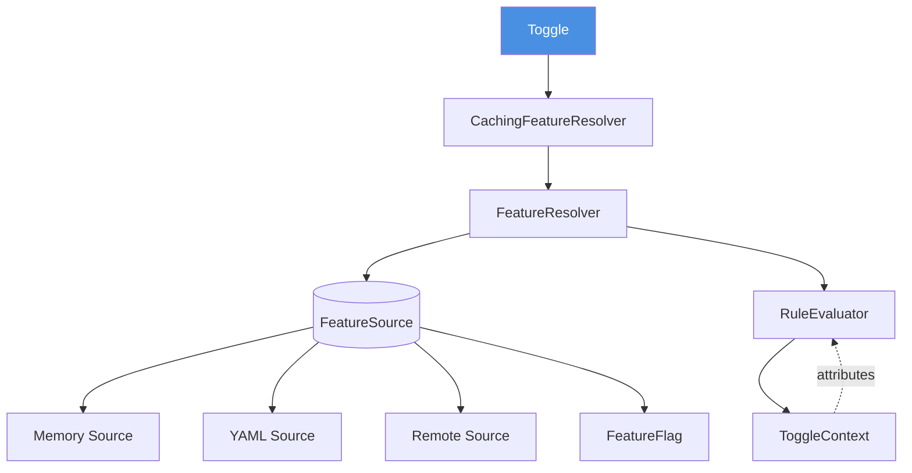

<p align="center">
  <a href="https://github.com/getspherelabs/meteor"></a> <br>
</p>

<p align="center">
  <a href="https://github.com/behzodhalil/toggle/releases">
    
  </a>
  <a href="https://opensource.org/licenses/Apache-2.0">
    
  </a>
  <a href="https://kotlinlang.org">
    
  </a>
  <a href="https://github.com/behzodhalil/toggle">
    
  </a>
</p>

## Table of Contents

- [Overview](#overview)
- [Installation](#installation)
- [Architecture](#architecture)
- [Documentation](#documentation)
    - [Getting Started](#getting-started)
    - [Sources](#sources)
    - [Contextual Evaluation](#contextual-evaluation)
    - [Rule Evaluators](#rule-evaluators)
    - [Observable Toggle](#observable-toggle)
    - [Compose Integration](#compose-integration)

- [License](#license)

## Overview

Toggle is a modern, type-safe feature flag library designed for Kotlin Multiplatform. It provides a clean, composable API for managing feature flags across Android, iOS, JVM.

**What makes Toggle different:**

- **Type-Safe**: Strongly-typed feature keys prevent runtime errors from typos
- **Composable**: Priority-based source composition with memory, YAML, and custom sources
- **Contextual**: Evaluate features based on user attributes, environment, and custom rules
- **Reactive**: Observe feature changes with Kotlin Flow and Jetpack Compose
- **Platform-Agnostic**: Write once, run anywhere with Kotlin Multiplatform
- **Production-Ready**: Built-in caching, lifecycle management, and error handling

Toggle follows a layered architecture where multiple sources can provide feature flags, and custom rule evaluators determine the final enabled state based on context.

---

## Architecture

Toggle follows a **layered architecture** with clear separation of concerns:


### Key Components

1. **Toggle**: Main entry point, coordinates all operations
2. **FeatureResolver**: Resolves features from sources and applies rules
3. **CachingFeatureResolver**: Caches resolved features for performance
4. **FeatureSource**: Provides feature flags (memory, YAML, remote, etc.)
5. **RuleEvaluator**: Evaluates if features should be enabled based on context
6. **ToggleContext**: Holds user/environment attributes for targeting
7. **FeatureFlag**: Immutable value object representing a feature's state
8. **ObservableToggle**: Reactive wrapper for observing feature changes


---

## Installation

Toggle is published to Maven Central.

### Gradle (Kotlin DSL)

Add the dependency to your `build.gradle.kts`:

```kotlin
// For Kotlin Multiplatform
kotlin {
    sourceSets {
        val commonMain by getting {
            dependencies {
                implementation("io.github.behzodhalil:toggle-core:0.1.0")
            }
        }
    }
}

// For Jetpack Compose support
dependencies {
    implementation("io.github.behzodhalil:toggle-compose:0.1.0")
}
```

### Gradle (Groovy)

```groovy
// Android/JVM
dependencies {
    implementation 'io.github.behzodhalil:toggle-core:0.1.0'
    implementation 'io.github.behzodhalil:toggle-compose:0.1.0'
}
```


## Documentation

### Getting Started

Toggle uses a **builder pattern** for configuration. The core concept revolves around three main components:

1. **Sources** - Where feature flags come from (memory, YAML, remote services)
2. **Context** - User/environment attributes for targeting rules
3. **Evaluators** - Rules that determine if a feature should be enabled

#### Creating a Toggle Instance

```kotlin
val toggle = Toggle {
    // Configure feature sources
    sources {
        memory {
            priority = 200  // Highest priority
            feature(Features.DEBUG_MODE, true)
        }

        yaml {
            priority = 100
            resourcePath = "features.yaml"
        }
    }

    // Set evaluation context
    context {
        userId("user_123")
        attribute("country", "US")
        attribute("appVersion", "2.0.0")
    }

    // Add custom evaluators
    evaluation {
        percentageRollout(50)  // 50% rollout
    }

    // Enable debug logging
    debug()
}
```

### Sources

Sources provide feature flag values. Toggle queries sources in **descending priority order** and uses the first non-null result.

#### Built-in Sources

##### 1. Memory Source

In-memory feature storage, ideal for runtime overrides and testing.

```kotlin
Toggle {
    sources {
        memory {
            priority = 200

            // Add features
            feature(Features.DARK_MODE, enabled = true)
            feature(Features.PREMIUM, enabled = false, metadata = mapOf(
                "tier" to "gold",
                "trial_days" to "30"
            ))
        }
    }
}
```

**Use cases:**
- Runtime feature overrides (e.g., debug menus)
- A/B test variant assignment
- Temporary feature toggles
- Testing

##### 2. YAML Source

Load features from YAML files in your resources.

```kotlin
Toggle {
    sources {
        yaml {
            priority = 100
            resourcePath = "features.yaml"
            // or: content = yamlString
        }
    }
}
```

**features.yaml:**
```yaml
features:
  dark_mode:
    enabled: true
    metadata:
      owner: "design-team"
      description: "Dark theme support"

  premium_feature:
    enabled: false
    metadata:
      tier: "gold"
      min_version: "2.0.0"

  beta_ui:
    enabled: true
    metadata:
      rollout_percentage: "50"
      experiment_id: "exp_123"
```

**Use cases:**
- Shipped default configuration
- Per-environment configs
- Static feature definitions
- Offline-first applications

##### 3. Custom Sources

Implement the `FeatureSource` interface for custom backends:

```kotlin
class RemoteConfigSource(
    private val remoteConfig: FirebaseRemoteConfig
) : FeatureSource {
    override val priority: Int = 150
    override val sourceName: String = "remote_config"

    override suspend fun refresh() {
        remoteConfig.fetchAndActivate().await()
    }

    override fun get(key: String): FeatureFlag? {
        val enabled = remoteConfig.getBoolean(key)
        return FeatureFlag(
            key = key,
            enabled = enabled,
            source = sourceName
        )
    }

    override fun getAll(): List<FeatureFlag> = emptyList()
    override fun close() {}
}

// Use it:
Toggle {
    sources {
        source(RemoteConfigSource(firebaseRemoteConfig))
        memory { priority = 200 }  // Fallback
    }
}
```

**Use cases:**
- Firebase Remote Config integration
- Custom API backends
- Database-backed features

#### Source Priority

Sources are queried in **descending priority order**:

```kotlin
Toggle {
    sources {
        memory { priority = 200 }      // Checked first
        remote { priority = 150 }      // Checked second
        yaml { priority = 100 }        // Checked third (fallback)
    }
}
```

**Common priority patterns:**
- **200**: Runtime overrides (memory)
- **150**: Remote configuration
- **100**: Local defaults (YAML)
- **50**: Fallback/defaults

---

### Contextual Evaluation

Context provides attributes for targeting rules. Use context to enable features for specific users, regions, or app versions.

#### Setting Context

```kotlin
Toggle {
    context {
        // User attributes
        userId("user_123")
        attribute("email", "user@example.com")
        attribute("subscription", "premium")

        // Environment
        attribute("country", "US")
        attribute("language", "en")
        attribute("timezone", "America/New_York")

        // Application
        attribute("appVersion", "2.1.0")
        attribute("platform", "Android")
        attribute("deviceType", "tablet")

        // Custom
        attribute("experimentGroup", "variant_a")
        attribute("accountAge", 365)
    }
}
```

#### Accessing Context

```kotlin
val context = toggle.context
val userId = context.get("userId")
val country = context.get("country")
```

---

### Rule Evaluators

Evaluators contain the logic for determining if a feature should be enabled based on context.

#### Built-in Evaluators

##### Percentage Rollout

Gradually roll out features to a percentage of users:

```kotlin
class PercentageRolloutEvaluator(
    private val percentage: Int
) : RuleEvaluator {
    override fun evaluate(flag: FeatureFlag, context: ToggleContext): Boolean {
        if (!flag.enabled) return false

        val userId = context.get("userId")?.toString() ?: return false
        val hash = (userId.hashCode() and Int.MAX_VALUE) % 100

        return hash < percentage
    }
}

// Usage:
Toggle {
    sources {
        yaml { resourcePath = "features.yaml" }
    }

    evaluation {
        rule(PercentageRolloutEvaluator(percentage = 25))  // 25% rollout
    }
}
```

---

### Observable Toggle

Toggle supports reactive feature observation using Kotlin Flow. This is particularly useful for UI updates when features change.

#### Creating an Observable Toggle

```kotlin
val toggle = Toggle {
    sources {
        memory {
            feature(Features.DARK_MODE, true)
        }
    }
}

val observableToggle = ObservableToggle {
    this.toggle = toggle
    bufferCapacity = 64  // Flow buffer size
}

// Observe a feature
observableToggle.observe(Features.DARK_MODE)
    .onEach { enabled ->
        println("Dark mode is now: $enabled")
    }
    .launchIn(scope)
```

#### Updating Features

```kotlin
// Update feature in memory source
memorySource.setFeature(Features.DARK_MODE, false)

// Notify observers
observableToggle.notifyChanged(Features.DARK_MODE)
```

---

### Compose Integration

Toggle provides first-class support for Jetpack Compose with reactive state observation.

#### Basic Usage

```kotlin
@Composable
fun FeatureToggleExample() {
    val toggle = rememberToggle {
        sources {
            memory {
                feature(Features.DARK_MODE, true)
                feature(Features.BETA_UI, false)
            }
        }
    }

    val observable = rememberObservableToggle(toggle)

    // Observe features
    val isDarkMode by observable.observeAsState(Features.DARK_MODE)
    val isBetaUI by observable.observeAsState(Features.BETA_UI)

    Column {
        Text("Dark Mode: ${if (isDarkMode) "ON" else "OFF"}")
        Text("Beta UI: ${if (isBetaUI) "ON" else "OFF"}")
    }
}
```

#### Providing Toggle via CompositionLocal

```kotlin
// At app level
@Composable
fun App() {
    val toggle = rememberToggle {
        sources {
            yaml { resourcePath = "features.yaml" }
        }
    }

    val observable = rememberObservableToggle(toggle)

    CompositionLocalProvider(
        LocalToggle provides toggle,
        LocalObservableToggle provides observable
    ) {
        MainScreen()
    }
}

// In child composables
@Composable
fun ChildScreen() {
    val observable = LocalObservableToggle.current
    val isPremium by observable.observeAsState(Features.PREMIUM)

    if (isPremium) {
        PremiumContent()
    } else {
        FreeContent()
    }
}
```

#### Conditional Rendering

```kotlin
@Composable
fun ConditionalFeature() {
    val observable = LocalObservableToggle.current
    val showNewUI by observable.observeAsState(Features.NEW_UI)

    if (showNewUI) {
        NewUserInterface()
    } else {
        LegacyUserInterface()
    }
}
```

#### Lifecycle-Aware Observation

The `observeAsState` composable uses `collectAsStateWithLifecycle`, which means:
- Observations pause when the UI is in the background
- No memory leaks from abandoned observations
- Automatic cleanup when composables leave composition

```kotlin
@Composable
fun LifecycleAwareFeature() {
    val observable = LocalObservableToggle.current

    // Automatically pauses/resumes with lifecycle
    val isEnabled by observable.observeAsState(Features.EXPERIMENTAL)

    // Use isEnabled...
}
```

---


## License

```
Copyright 2024 Behzod Halil

Licensed under the Apache License, Version 2.0 (the "License");
you may not use this file except in compliance with the License.
You may obtain a copy of the License at

    http://www.apache.org/licenses/LICENSE-2.0

Unless required by applicable law or agreed to in writing, software
distributed under the License is distributed on an "AS IS" BASIS,
WITHOUT WARRANTIES OR CONDITIONS OF ANY KIND, either express or implied.
See the License for the specific language governing permissions and
limitations under the License.
```

<p align="center">
  <a href="https://github.com/behzodhalil/toggle/releases">
    
  </a>
  <a href="https://opensource.org/licenses/Apache-2.0">
    
  </a>
  <a href="https://kotlinlang.org">
    
  </a>
  <a href="https://github.com/behzodhalil/toggle">
    
  </a>
</p>

## Table of Contents

- [Overview](#overview)
- [Installation](#installation)
- [Architecture](#architecture)
- [Documentation](#documentation)
    - [Getting Started](#getting-started)
    - [Sources](#sources)
    - [Contextual Evaluation](#contextual-evaluation)
    - [Rule Evaluators](#rule-evaluators)
    - [Observable Toggle](#observable-toggle)
    - [Compose Integration](#compose-integration)

- [License](#license)

## Overview

Toggle is a modern, type-safe feature flag library designed for Kotlin Multiplatform. It provides a clean, composable API for managing feature flags across Android, iOS, JVM.

**What makes Toggle different:**

- **Type-Safe**: Strongly-typed feature keys prevent runtime errors from typos
- **Composable**: Priority-based source composition with memory, YAML, and custom sources
- **Contextual**: Evaluate features based on user attributes, environment, and custom rules
- **Reactive**: Observe feature changes with Kotlin Flow and Jetpack Compose
- **Platform-Agnostic**: Write once, run anywhere with Kotlin Multiplatform
- **Production-Ready**: Built-in caching, lifecycle management, and error handling

Toggle follows a layered architecture where multiple sources can provide feature flags, and custom rule evaluators determine the final enabled state based on context.

---

## Architecture

Toggle follows a **layered architecture** with clear separation of concerns:


### Key Components

1. **Toggle**: Main entry point, coordinates all operations
2. **FeatureResolver**: Resolves features from sources and applies rules
3. **CachingFeatureResolver**: Caches resolved features for performance
4. **FeatureSource**: Provides feature flags (memory, YAML, remote, etc.)
5. **RuleEvaluator**: Evaluates if features should be enabled based on context
6. **ToggleContext**: Holds user/environment attributes for targeting
7. **FeatureFlag**: Immutable value object representing a feature's state
8. **ObservableToggle**: Reactive wrapper for observing feature changes


---

## Installation

Toggle is published to Maven Central.

### Gradle (Kotlin DSL)

Add the dependency to your `build.gradle.kts`:

```kotlin
// For Kotlin Multiplatform
kotlin {
    sourceSets {
        val commonMain by getting {
            dependencies {
                implementation("io.github.behzodhalil:toggle-core:0.1.0")
            }
        }
    }
}

// For Jetpack Compose support
dependencies {
    implementation("io.github.behzodhalil:toggle-compose:0.1.0")
}
```

### Gradle (Groovy)

```groovy
// Android/JVM
dependencies {
    implementation 'io.github.behzodhalil:toggle-core:0.1.0'
    implementation 'io.github.behzodhalil:toggle-compose:0.1.0'
}
```


## Documentation

### Getting Started

Toggle uses a **builder pattern** for configuration. The core concept revolves around three main components:

1. **Sources** - Where feature flags come from (memory, YAML, remote services)
2. **Context** - User/environment attributes for targeting rules
3. **Evaluators** - Rules that determine if a feature should be enabled

#### Creating a Toggle Instance

```kotlin
val toggle = Toggle {
    // Configure feature sources
    sources {
        memory {
            priority = 200  // Highest priority
            feature(Features.DEBUG_MODE, true)
        }

        yaml {
            priority = 100
            resourcePath = "features.yaml"
        }
    }

    // Set evaluation context
    context {
        userId("user_123")
        attribute("country", "US")
        attribute("appVersion", "2.0.0")
    }

    // Add custom evaluators
    evaluation {
        percentageRollout(50)  // 50% rollout
    }

    // Enable debug logging
    debug()
}
```

### Sources

Sources provide feature flag values. Toggle queries sources in **descending priority order** and uses the first non-null result.

#### Built-in Sources

##### 1. Memory Source

In-memory feature storage, ideal for runtime overrides and testing.

```kotlin
Toggle {
    sources {
        memory {
            priority = 200

            // Add features
            feature(Features.DARK_MODE, enabled = true)
            feature(Features.PREMIUM, enabled = false, metadata = mapOf(
                "tier" to "gold",
                "trial_days" to "30"
            ))
        }
    }
}
```

**Use cases:**
- Runtime feature overrides (e.g., debug menus)
- A/B test variant assignment
- Temporary feature toggles
- Testing

##### 2. YAML Source

Load features from YAML files in your resources.

```kotlin
Toggle {
    sources {
        yaml {
            priority = 100
            resourcePath = "features.yaml"
            // or: content = yamlString
        }
    }
}
```

**features.yaml:**
```yaml
features:
  dark_mode:
    enabled: true
    metadata:
      owner: "design-team"
      description: "Dark theme support"

  premium_feature:
    enabled: false
    metadata:
      tier: "gold"
      min_version: "2.0.0"

  beta_ui:
    enabled: true
    metadata:
      rollout_percentage: "50"
      experiment_id: "exp_123"
```

**Use cases:**
- Shipped default configuration
- Per-environment configs
- Static feature definitions
- Offline-first applications

##### 3. Custom Sources

Implement the `FeatureSource` interface for custom backends:

```kotlin
class RemoteConfigSource(
    private val remoteConfig: FirebaseRemoteConfig
) : FeatureSource {
    override val priority: Int = 150
    override val sourceName: String = "remote_config"

    override suspend fun refresh() {
        remoteConfig.fetchAndActivate().await()
    }

    override fun get(key: String): FeatureFlag? {
        val enabled = remoteConfig.getBoolean(key)
        return FeatureFlag(
            key = key,
            enabled = enabled,
            source = sourceName
        )
    }

    override fun getAll(): List<FeatureFlag> = emptyList()
    override fun close() {}
}

// Use it:
Toggle {
    sources {
        source(RemoteConfigSource(firebaseRemoteConfig))
        memory { priority = 200 }  // Fallback
    }
}
```

**Use cases:**
- Firebase Remote Config integration
- Custom API backends
- Database-backed features

#### Source Priority

Sources are queried in **descending priority order**:

```kotlin
Toggle {
    sources {
        memory { priority = 200 }      // Checked first
        remote { priority = 150 }      // Checked second
        yaml { priority = 100 }        // Checked third (fallback)
    }
}
```

**Common priority patterns:**
- **200**: Runtime overrides (memory)
- **150**: Remote configuration
- **100**: Local defaults (YAML)
- **50**: Fallback/defaults

---

### Contextual Evaluation

Context provides attributes for targeting rules. Use context to enable features for specific users, regions, or app versions.

#### Setting Context

```kotlin
Toggle {
    context {
        // User attributes
        userId("user_123")
        attribute("email", "user@example.com")
        attribute("subscription", "premium")

        // Environment
        attribute("country", "US")
        attribute("language", "en")
        attribute("timezone", "America/New_York")

        // Application
        attribute("appVersion", "2.1.0")
        attribute("platform", "Android")
        attribute("deviceType", "tablet")

        // Custom
        attribute("experimentGroup", "variant_a")
        attribute("accountAge", 365)
    }
}
```

#### Accessing Context

```kotlin
val context = toggle.context
val userId = context.get("userId")
val country = context.get("country")
```

---

### Rule Evaluators

Evaluators contain the logic for determining if a feature should be enabled based on context.

#### Built-in Evaluators

##### Percentage Rollout

Gradually roll out features to a percentage of users:

```kotlin
class PercentageRolloutEvaluator(
    private val percentage: Int
) : RuleEvaluator {
    override fun evaluate(flag: FeatureFlag, context: ToggleContext): Boolean {
        if (!flag.enabled) return false

        val userId = context.get("userId")?.toString() ?: return false
        val hash = (userId.hashCode() and Int.MAX_VALUE) % 100

        return hash < percentage
    }
}

// Usage:
Toggle {
    sources {
        yaml { resourcePath = "features.yaml" }
    }

    evaluation {
        rule(PercentageRolloutEvaluator(percentage = 25))  // 25% rollout
    }
}
```

---

### Observable Toggle

Toggle supports reactive feature observation using Kotlin Flow. This is particularly useful for UI updates when features change.

#### Creating an Observable Toggle

```kotlin
val toggle = Toggle {
    sources {
        memory {
            feature(Features.DARK_MODE, true)
        }
    }
}

val observableToggle = ObservableToggle {
    this.toggle = toggle
    bufferCapacity = 64  // Flow buffer size
}

// Observe a feature
observableToggle.observe(Features.DARK_MODE)
    .onEach { enabled ->
        println("Dark mode is now: $enabled")
    }
    .launchIn(scope)
```

#### Updating Features

```kotlin
// Update feature in memory source
memorySource.setFeature(Features.DARK_MODE, false)

// Notify observers
observableToggle.notifyChanged(Features.DARK_MODE)
```

---

### Compose Integration

Toggle provides first-class support for Jetpack Compose with reactive state observation.

#### Basic Usage

```kotlin
@Composable
fun FeatureToggleExample() {
    val toggle = rememberToggle {
        sources {
            memory {
                feature(Features.DARK_MODE, true)
                feature(Features.BETA_UI, false)
            }
        }
    }

    val observable = rememberObservableToggle(toggle)

    // Observe features
    val isDarkMode by observable.observeAsState(Features.DARK_MODE)
    val isBetaUI by observable.observeAsState(Features.BETA_UI)

    Column {
        Text("Dark Mode: ${if (isDarkMode) "ON" else "OFF"}")
        Text("Beta UI: ${if (isBetaUI) "ON" else "OFF"}")
    }
}
```

#### Providing Toggle via CompositionLocal

```kotlin
// At app level
@Composable
fun App() {
    val toggle = rememberToggle {
        sources {
            yaml { resourcePath = "features.yaml" }
        }
    }

    val observable = rememberObservableToggle(toggle)

    CompositionLocalProvider(
        LocalToggle provides toggle,
        LocalObservableToggle provides observable
    ) {
        MainScreen()
    }
}

// In child composables
@Composable
fun ChildScreen() {
    val observable = LocalObservableToggle.current
    val isPremium by observable.observeAsState(Features.PREMIUM)

    if (isPremium) {
        PremiumContent()
    } else {
        FreeContent()
    }
}
```

#### Conditional Rendering

```kotlin
@Composable
fun ConditionalFeature() {
    val observable = LocalObservableToggle.current
    val showNewUI by observable.observeAsState(Features.NEW_UI)

    if (showNewUI) {
        NewUserInterface()
    } else {
        LegacyUserInterface()
    }
}
```

#### Lifecycle-Aware Observation

The `observeAsState` composable uses `collectAsStateWithLifecycle`, which means:
- Observations pause when the UI is in the background
- No memory leaks from abandoned observations
- Automatic cleanup when composables leave composition

```kotlin
@Composable
fun LifecycleAwareFeature() {
    val observable = LocalObservableToggle.current

    // Automatically pauses/resumes with lifecycle
    val isEnabled by observable.observeAsState(Features.EXPERIMENTAL)

    // Use isEnabled...
}
```

---


## License

```
Copyright 2025 Behzod Halil

Licensed under the Apache License, Version 2.0 (the "License");
you may not use this file except in compliance with the License.
You may obtain a copy of the License at

    http://www.apache.org/licenses/LICENSE-2.0

Unless required by applicable law or agreed to in writing, software
distributed under the License is distributed on an "AS IS" BASIS,
WITHOUT WARRANTIES OR CONDITIONS OF ANY KIND, either express or implied.
See the License for the specific language governing permissions and
limitations under the License.
```
